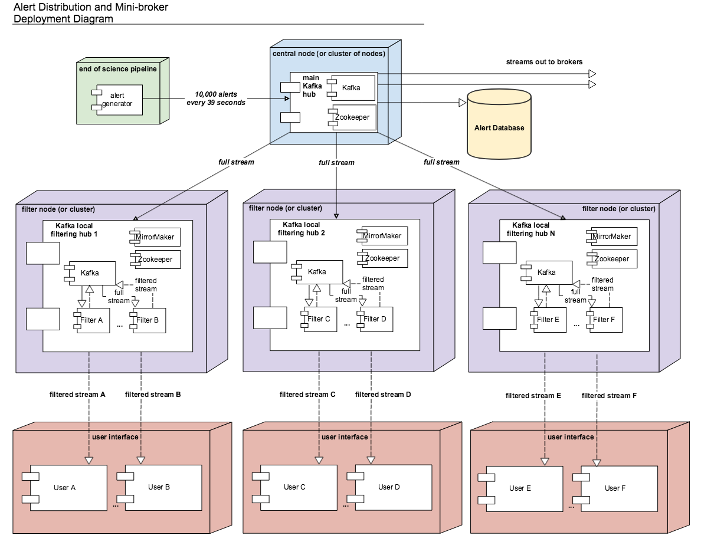

:tocdepth: 1

.. Please do not modify tocdepth; will be fixed when a new Sphinx theme is shipped.

.. sectnum::

Abstract
=========

We describe the proposed design and implementation of the LSST Alert Distribution Serice, which provides rapid dissemination of alerts as well as the capability to apply simple filters to alert streams.
At time of writing, this service is still under development; this “living document” describes current thinking, but is expected to evolve over the course of LSST construction.

Alert Serialization
===================

Packet Format
-------------

Alerts are packaged using Apache Avro :cite:`avro`.
Avro is a framework for data serialization in a compact binary format.
It has been used at scale in both industry and science, and it is the recommended format for data streamed with Apache Kafka.
Avro is more structured in format than JSON or XML, the currently used format of VOEvent 2.0.
Furthermore, image — or other — files can be embedded in Avro packets, making it possible to embed postage stamp cutouts of detected difference image sources in a much more compact and convenient way than the current VOEvent standard.
Libraries for reading and writing Avro are available in many languages, including Python.

Each alert is packaged as its own Avro packet, as opposed to wrapping groups of alerts per visit together.
As alerts are anticipated to arrive independently from the end of the Alert Generation Pipeline parallelized by CCD, the Kafka platform (see :ref:`alertDist`) acts as a cache before distribution, and individually packaged alerts makes this process simple.
Additionally, packaging alerts separately allows filters to take individual alerts as input and pass each alert independently without having to repackage groups, which makes chaining filters straightforward.

Alert Schemata
--------------

Purpose and Structure
^^^^^^^^^^^^^^^^^^^^^

Avro alert packets are composed of opaque binary data.
Interpretation of this data is done according to a *schema*, which defines the type and structure of each field within the packet.
Strict adherence to the schema ensures that data will be correctly interpreted upon receipt.

Avro schemas can be composed of nested sub-schemas under a top level namespace.
Nesting simplifies what would otherwise be monolithic schemas as new fields are added.
For example, the base alert schema (``lsst.alert``) is of type "record" and includes previous detections of DIA sources as an array of type ``lsst.alert.diaSource``.

The current schema proposed for use with LSST alerts is stored in the `lsst-dm/sample-avro-alert`_ repository.
This contains all fields specified by the LSST Data Products Definition Document (LSE-163; :cite:`LSE-163`).
At this stage in construction, this schema should be regarded as exploratory and subject to rapid change; as we move closer to the operational era, a change control process will be implemented.

.. _lsst-dm/sample-avro-alert: https://github.com/lsst-dm/sample-avro-alert

Management and Evolution
^^^^^^^^^^^^^^^^^^^^^^^^

Avro packets may be shipped with or without an embedded schema.
Since the schema can be lengthy, and since each alert will be packaged for shipping separately, we expect to distribute alerts separately from the associated schema.

The recipient of each packet requires a schema to interpret the data they have been sent.
In the simplest model, the producer (the LSST Alert Distribution System) and the consumer (the remote broker or science user) simply agree on the schema prior to the start of the stream.
In practice, however, this is impractical: over the course of LSST operations, we anticipate that the alert schema will evolve in response to changing technical and scientific requirements.
At the same time, this change must be managed so as to cause minimum disruption to consumers.

Given the concerns above, we expect to adopt the following protocol:

- The LSST Project will make available a registry of all alert schemata ever used operationally by LSST.
  Schemata may be retrieved from this registry by some convenient interface given a four-byte schema ID.
  Conceptually, this is equivalent to the `Confluent Schema Registry`_, although it is possible an alternative implementation will be deployed in practice.
- Alerts will be transmitted following the `Confluent Wire Format`_.
  That is, the alert data encoded in Avro format will be prepended with a “magic byte” indicating the version of the wire format in use and the four-byte schema ID.
- On receipt of an alert packet, the consumer can retrieve the appropriate schema from the registry before attempting to interpret the packet.
  (Consumers are expected to cache the schema, rather than requesting a fresh copy of it for every packet received!)

LSST alert schemata will follow a ``MAJOR.MINOR`` versioning scheme.

Within a given ``MAJOR`` version, schemata will follow the ``FORWARD_TRANSITIVE`` type of `Confluent compatibility model`_.
In this model, data produced by a newer schema can be interpreted by a consumer using an older schema.
The producer may add fields to the schema (which will not be seen by the consumer) and may delete *optional* fields (in which case the consumer will see the default value).
In this way, LSST may add to or augment the contents of alert packets without impacting consumers (of course, consumers who wish to take advantage of the new information available will have to upgrade their systems to match the new schema).
All such additions or augmentations to the schema will result in a new ``MINOR`` version being generated.

In some cases, a break with compatibility may be required (for example, when some particular data product is rendered obsolete, deleting the corresponding field from the alert schema will break the ``FORWARD_TRANSITIVE`` compatibility guarantee).
Such a break with compatibility will be signified by the release of a new ``MAJOR`` version of the schema.
Issuing a new ``MAJOR`` version of the schema will require action on the part of consumers: some data on which they may be relying is no longer available.
Consumers will have to update their systems to continue following the alert stream.

The Confluent Schema Registry makes it possible for schemata to evolve within a given *subject name* while enforcing the specified compatibility model.
Thus, a given ``MAJOR`` version of the schema may be published with a particular subject name (for example, ``lsst-alert-N`` for ``MAJOR`` version ``N``); releasing a new major version will necessitate defining a new subject.

.. _Confluent Schema Registry: https://docs.confluent.io/current/schema-registry/docs/index.html
.. _Confluent Wire Format: https://docs.confluent.io/current/schema-registry/docs/serializer-formatter.html#wire-format
.. _Confluent compatibility model: https://docs.confluent.io/current/schema-registry/docs/avro.html#forward-compatibility

Example Data
^^^^^^^^^^^^

At present, Avro files populated with plausible data following the published schema are available in the :file:`data/` directory of the `lsst-dm/alert_stream`_ repository.
Although we expect to continue to make example alert data available for the indefinite future, the contents, format, and location is subject to change with time.

.. _lsst-dm/alert_stream: https://github.com/lsst-dm/alert_stream

.. _alertDist:

Alert Distribution
==================

Alert distribution uses Apache Kafka :cite:`kafka`,
an open source streaming platform
that can be used for real-time and continuous data pipelines.
Kafka is a scalable pub/sub message queue based on a commit log.
It is used in production at scale at companies such as LinkedIn,
Netflix, and Microsoft to process over 1 trillion messages per day.

Kafka collects messages from processes called "producers,"
which are organized into distinct streams called "topics."
Downstream "consumers" pull messages by subscribing to topics.
Topics can be split into "partitions" that may be distributed
across multiple machines and allow consumers to read in
parallel as "consumer groups."
Data can be replicated by deploying Kafka in cluster mode over several
servers called "brokers."
We will refer to these brokers below as "Kafka brokers" to distinguish
from the LSST alert downstream "community brokers" that will process
LSST alerts.

For LSST alert distribution, Kafka and the accompanying Zookeeper
can be deployed as Docker containers from the DockerHub image repository
maintained by Confluent Inc., the team that created Kafka.
The latest release of ``alert_stream`` uses Kafka and Zookeeper from
Confluent platform release 4.1.1, which was the latest version available
as of the dmtn-081-2018-06-18 tagged release of ``alert_stream``
used in DMTN-081.
As of the writing of this document, Confluent platform release 5.0
corresponding to Apache Kafka version 2.0 is now available.
The producer used for generating and sending data to Kafka and
template scripts for consumers of the stream are provided in the GitHub
repository at https://github.com/lsst-dm/alert_stream,
which can also be built as a Docker image and deployed as containers.
DMTN-028 :cite:`DMTN-028`
provides details about benchmarking deployment of the different components.

Alert Filtering
================

Alert filters can be written using Python functions
acting solely on the contents of the alert packets, as
described in the Data Products Definition Document.
Using Python allows scientific users to write complex functions in
a language that may be familiar and approachable to most astronomers.
If permitted, scientists could also potentially use modules outside of the
standard library to deploy, e.g., machine learning algorithms on alerts.
User-provided code, however, presents challenges.
The filter submission process needs to be controlled.
Access to the host system needs to be restricted to prevent malicious
activity and security concerns.
To mitigate the concerns of user-provided code, in this design
each filter runs separately and isolated in its own container.
The filter is only allowed access to the approved libraries available in
the Python environment provided in the container, and permissions
of the container can be restricted so as to minimize effects on the host.

A filter is constructed as a consumer of the Kafka topic containing the
full stream and a producer back to a Kafka topic for the filtered stream.
This filtered stream can then be read by another consumer or directed
to another output method for storage.
The downstream consumer of the filtered stream can itself be another
filter, meaning that this scheme allows simple chaining of filters.

Currently, filters are defined in ``lsst.alert.stream.filters`` in the
alert_stream repository.
Each filter is constructed as a class with a filter function.
Below is an example of code defining a simple filter.

.. code-block:: Python

  class Filter001(AlertFilter):
      def filter(self, alert):
          if ((alert['diaSource']['snr'] > 5) &
              (alert['diaSource']['diffFlux'] > 0.00003631)):  # 20th mag
              return True
          else:
              return False

Filters inherit from an AlertFilter base class.
When the filter class is called on each alert, the visit ID is read.
Up to 20 alerts per visit that pass the filter, i.e., return True, are
forwarded to its local Kafka instance to a topic for the filtered alerts,
named for the class.
In the above example, alerts are sent to a new topic named "Filter001."
The filter detects the beginning of a new visit when the visit ID
changes from one alert to the next.
This assumes that all alerts from a visit will be received before
the next visit's alerts arrive.
Otherwise, more than 20 alerts may pass through the filter.

An excess of 20 alerts is not cause for concern but is defined by
``numBrokerAlerts`` (Number of full-sized alerts that can be received
per visit per user) in performance requirement DMS-REQ-0343 which
was put in place as a coarse load-balancing measure.
Raising this limit would potentially produce scientific gains as a larger
number of alerts of interest would be available to scientific users.
Currently, the first 20 alerts passing the filter are made available
to users, and there is no ability to rank order or otherwise choose
the most scientifically interesting 20 filtered alerts.
Increasing the limit, however, would also increase the network
bandwidth necessary to accommodate larger filtered streams.
The current requirement for ``numBrokerUsers`` (Supported number of simultaneous
users connected to the LSST alert filtering system) is set at 100,
meaning that the system is at least required to support the
bandwidth needed for 100 filtered streams with 20 alerts per visit.
Increasing the filtered alert limit could then mean that fewer
users would be able to be supported due to networking limitations.
DMS-REQ-0343 notes that the requirement could also be satisfied
by cutting down the content of filtered alerts and potentially
removing fields to decrease the size of filtered streams.

Alert Database
==============

Coming in a future edition of this document.

Deployment
===========

The deployment of the alert distribution and mini-broker described here differs
from the prototype described in DMTN-081
:cite:`DMTN-081`
and has been revised with significant improvement in design.
DMTN-081 describes a system in which groups of filters are deployed
in a single container, sharing one copy of the full alert stream
and utilizing Python's multiprocessing module to parallelize the filters.
Having a group of filters share a copy of the full alert stream
minimizes the number of full streams and the amount of data
that needs to be pulled from Kafka, which is necessary given
a cap on the network bandwidth available for the system.
Additionally, the load of a large number (~10) of consumers,
i.e. a large number of full streams, may cause filters to lag
and not be able to keep up with the volume and real-time velocity of alerts.
(See DMTN-028. :cite:`DMTN-028`)

The previous design deploys filters in groups in order to avoid the
bandwidth needed to otherwise support the design of a one-stream-per-filter
(and therefore 100+ streams) on a single Kafka instance.
The major drawback in this deployment is that groups of filters are running
within a single container and within a single executed Python script.
Filters cannot be isolated to their own environments, and one filter
may slow or otherwise affect another.

The design described here attempts to avoid both the bandwidth issue
and the issue of shared filter environments by placing
components methodically on the hardware available to the system.
This design separates each filter into its own Docker container so that
filters should have no effect on each other.
However, instead of having filter containers deployed on potentially
many separate nodes all consuming streams from one Kafka instance running
on its own dedicated node, a system of downstream Kafka mirrors are deployed
on several nodes from which co-located filters can read streams locally,
cutting down on the data throughput between nodes.
Filters run in separate Docker containers which are placed on the
same node as a Kafka instance mirroring the full stream pulled from the
upstream central Kafka hub where alerts are sent.
The number of mirrored Kafka instances / groups of filters able to
be supported is then determined by the node-to-node available bandwidth,
but the filters reading from the downstream local Kafka instances
can take advantage of the internal bandwidth of the node on which they run.

The updated deployment plan of the alert distribution system
including filtering with the mini-broker is shown in the figure below.
Content of the alerts is created in science pipelines, potentially
parallelized by CCD.
In the alert_stream repo, AlertProducers take as input Python dicts
representing the data generated at the end of the prompt processing pipeline.
The Python module used for Avro formatting takes these dicts
and an Avro schema as input to generate Avro alert packets
when alerts are sent to a central Kafka broker,
or cluster of Kafka brokers acting as one unit.
For testing, a single AlertProducer can be deployed from the
alert_stream repo that sends local Avro alert visit files to Kafka.
Each Kafka broker in this central hub is deployed on its own
node either with Zookeeper on the same node or Zookeeper on a separate
node with no other services running.
The main Kafka system streams to and feeds downstream community broker
consumers and sinks to the alert database.

The central Kafka system feeds the mini-broker filtering system,
which is made up of several independent nodes each running a local
instance of Kafka and Zookeeper.
A MirrorMaker instance also runs on each of these nodes and independently
sets up the local mirror of the full alert stream.
Filters are deployed in separate Docker containers for each
on the same node as the local Kafka hub.
The filters read from and write to their local Kafka instance.
In testing on AWS, up to 50 filters may run on each node,
using m4.4xlarge instances.
An m4.4xlarge instance has 14 vCPU, 64 GiB memory, and 2,000 Mbps
dedicated bandwidth to its Elastic Block Store SSD storage volume.

The alert_stream code contains a file of filter classes,
as described above.
In the deployment scripts, a filterStream.py file is included
that takes as input the Kafka broker ip to connect to (i.e,
the address of the local Kafka instance), the topic name of the
full stream of alerts to filter, and the number of the filter
in the list of filter classes to run.
For example, running a container with the command

.. code-block:: Python

    python filterStream.py kafka:9092 full-stream 7

will deploy the seventh filter in the list of filter classes.
Here the classes included are labeled ``Filter001`` - ``Filter100``,
writing to filtered topics of the same name, but these names
are flexible.

The local Kafka instances used for filtering feed downstream consumer users.
In the deployment scripts, a consumer is started in a separate container
for each filtered stream.
These consumers are deployed on separate nodes from the filtering nodes.
Up to 50 consumers have been tested per node on the same type of
instance as the filtering nodes, m4.4xlarge.

Deployment scripts for deploying a full mini-broker configuration
(a producer, central Kafka instance, filtering Kafka instances,
filters, and consumers) are available in the alert_stream repo.
These scripts are specifically for a deployment using Docker Swarm.
As input, files listing the node IDs on which to run the different
components are needed.
The deployment will run 20 filters per node, and 100 total filters
are included.
Complete instructions for deploying on an AWS CloudFormation cluster
are included with the deployment scripts in the swarm directory
of alert_stream.

Remaining Work
===============

There is remaining work particularly in addressing questions around
resilience, how users interface with the system, and
feasibility of some "desirements."
Below are a few (non-exhaustive) outstanding questions and thoughts.

* How can we make the system resilient to a node going down?

One possibility would be to use Kafka in cluster mode and
take advantage of consumer groups.
Deploy all Kafka instances as clusters of e.g., 3 brokers
across different nodes.
For downstream Kafka clusters, put 3 Kafka instances (acting
as one unit) + Zookeepers + MirrorMakers on separate nodes.
All the MirrorMakers should be configured with the same group ID
and should be configured to produce to their local Kafka instance.
Using the same group ID should make sure that alerts are not duplicated,
i.e., the MirrorMakers pull alerts as in a queue from the central
Kafka cluster with no duplicates.
Downstream filter containers for the same filters can be deployed
across the 3 nodes with the same consumer group IDs set for each filter.
For example, a container filtering with Filter001 class can be deployed
on all 3 nodes, consuming from the local Kafka instance, all with
group ID "Filter001".
The filtered stream should not have duplicate alerts.

* How do we back up alerts?

Containers running Kafka should not use local storage (inside the
container) to store alerts but should use volume mounted disk.
Storage should be mounted to the /var/lib/kafka/data directory
inside the container.
If using Kafka in cluster mode, replication to > 1 can be set.
The volume mounted disk should also be backed up for as long as
data needs to be kept accessible via Kafka.

* How should we organize streams/topics?

It makes sense to create a new topic on a daily basis to make
it straightforward for downstream consumers to listen to
a night's worth of data, separate data of interest, and not
overwhelm consumers who want to, e.g., replay a night from last
week without reprocessing all alerts available since then.
Daily topics also make expiring nights of data straightforward
instead of ending up expiring data somewhere in the middle
of the night.

* For how long should we persist streams?

This is also partially a policy question.
The default setting in Kafka is to persist data for one week,
so topics older than one week could be removed.
(The topics will still exist unless deleted, but they will contain no alerts.)
Expiration of data can be set by a time limit or a storage cap.
The amount of time we will cache / allow “rewindable” access to the alert
stream and the number of partitions configured for each topic
sets requirements on the sizes and number of disks needed for storage.
See DMTN-028 for compute resource recommendations for different scenarios.
Some users of Kafka persist streams indefinitely in Kafka, essentially using
it as long-term storage, which could be an option for the LSST alert database.

* How/when are new filters added?

As the filtering code is currently written, each filter is defined as
a filter class in the lsst/alert/stream/filters.py file.
Whenever a filter class is accepted by the system (however filters
are generated by users), a filters.py file could be added to a newly
generated Docker image using "ADD" in the Dockerfile, or
a volume containing the file could be mounted to the appropriate
location in a container deployed from a standard image.
The second option is likely a better choice to keep from having too
many Docker images.
Filters should be able to be added at any time during the night
and for any night (topic) in Kafka that exists by setting the
topic name subscribed to.
The filter consumers can be set either to start reading from the
beginning of the topic (to rewind to the beginning of that night's
alerts) or from the current (or given) timestamp.
It may make sense to set filters to only filter the alerts from
that night's topics and expire filters every day.
Long-running filters, e.g., that might be approved to filter over
a time period approved by some sort of TAC, could be set to
subscribe to topics via topic wildcards.
When setting wildcarded topics, note well that Kafka uses Java Regex syntax.

* How do we and science users test filters?

For testing filters, it would be good to have a sandbox with a
separate Kafka instance or cluster with test topics.
There could be one central Kafka instance/cluster for the whole sandbox.
Or users could be able to launch their own containers of small Kafka instance
with a producer that loads in a standard set of well-described test data
(as in the single node alert_stream deployment instructions) and
test their filter containers using their local Kafka system.
Something to think about is how large are the test containers allowed to
be (what compute resources / memory, etc. are they allocated).
One could imagine that the testing sandbox could itself grow large,
but it would be good for users to have enough resources to test
their filters in the same environment as the production system.

.. .. rubric:: References

.. Make in-text citations with: :cite:`bibkey`.

.. bibliography:: local.bib lsstbib/books.bib lsstbib/lsst.bib lsstbib/lsst-dm.bib lsstbib/refs.bib lsstbib/refs_ads.bib
    :style: lsst_aa
